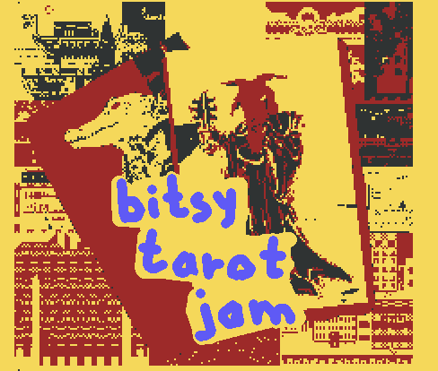

  
# tinyurl.com/bitsytarot

# schickt mir eure games an voec@posteo.net
   

   
    
**make a bitsy game:**  
**[http://ledoux.io/bitsy/editor.html](http://ledoux.io/bitsy/editor.html)**
    
    
    
    
# bitsy guides

[http://clairemorleyart.com/bitsy-twotorial/](http://clairemorleyart.com/bitsy-twotorial/)  
Kleines Intro zum Bitsy Editor

[https://ayolland.itch.io/trevor/devlog/29520/bitsy-variables-a-tutorial](https://ayolland.itch.io/trevor/devlog/29520/bitsy-variables-a-tutorial)  
Fortgeschrittenes Tutorial zu Variablen

    
    
# spiele hochladen

[https://itch.io](https://itch.io)  
Ein Portal bei dem man Spiele/Programme/Comics etcetc hochladen kann, kostenloses hosting, nette community!

Alternativ könnt ihr eure Bitsy .html Datei auch einfach auf eure Seite/blog/tumblr hochladen, oder einfach per mail verschicken

    
    
# bitsy community

[https://discord.gg/2aZHNHF](https://discord.gg/2aZHNHF)  
Bitsy discord community!

[https://twitter.com/hashtag/bitsy](https://twitter.com/hashtag/bitsy)  
tweeter auf twitter, #bitsy #bitsyjam

[https://ledoux.itch.io/bitsy](https://ledoux.itch.io/bitsy)  
Bitsy auf itch.io -- hier finden auch monatliche mini gamejams statt, bei denen jede*r mitmachen kann!

    
    
# mehr bitsy games

[https://medium.com/@HazelRah/odd-bits-of-bitsy-ee2d2dafcbf3](https://medium.com/@HazelRah/odd-bits-of-bitsy-ee2d2dafcbf3)  
Experimental games made using the Bitsy engine

[https://itch.io/search?q=bitsy](https://itch.io/search?q=bitsy)  
Alle Bitsy Games, die es auf itch.io gibt

[https://discojill.itch.io/his-only-love](https://discojill.itch.io/his-only-love)

[https://mozz.itch.io/finalohno](https://mozz.itch.io/finalohno)

[https://yellow-attic.itch.io/a-captains-lonely-60-days](https://yellow-attic.itch.io/a-captains-lonely-60-days)

[https://triage.itch.io/waking-up-while-the-sun-sets](https://triage.itch.io/waking-up-while-the-sun-sets)

[https://claire1605.itch.io/limbo-train](https://claire1605.itch.io/limbo-train)

[https://hyperstructure.itch.io/a-secret-bitsy-jam](https://hyperstructure.itch.io/a-secret-bitsy-jam)

[https://wjhollyart.itch.io/bric-a-brac-shop](https://wjhollyart.itch.io/bric-a-brac-shop)

[https://southtonk.itch.io/this-way-here](https://southtonk.itch.io/this-way-here)

    
# advanced bitsy (hacks und tools)

[http://www.clairemorleyart.com/bitsy-extras](http://www.clairemorleyart.com/bitsy-extras)  
Ein paar Tricks und Hacks für eure Bitsy Games, z.B. wie man Musik hinzufügt

[https://ayolland.github.io/borksy/](https://ayolland.github.io/borksy/)  
Borksy hacking tool um javascript in euer Spiel einzufügen

[https://ruin.itch.io/image-to-bitsy](https://ruin.itch.io/image-to-bitsy)  
Bilddateien in Bitsy Rooms konvertieren, super nützlich!

[https://sarahgould.github.io/palettsy/](https://sarahgould.github.io/palettsy/)  
Farbpaletten Generator

[https://github.com/seleb/bitsy-hacks](https://github.com/seleb/bitsy-hacks)  
Sehr gute Sammlung an javascript Hacks

    
    
# tarot & colossal cave

[https://splinternews.com/how-these-queer-artists-are-reinventing-tarot-cards-1793864153](https://splinternews.com/how-these-queer-artists-are-reinventing-tarot-cards-1793864153)  
Kleiner Artikel über queeres reclaiming und Ästhetiken im Tarot

[http://www.digitalhumanities.org/dhq/vol/1/2/000009/000009.html](http://www.digitalhumanities.org/dhq/vol/1/2/000009/000009.html)  
Spannender Text zu Colossal Cave Adventure und dem Bezug zu den Mammoth Cave Expeditionen
    
    
----
  
*made with love by [krisekrise & voec](http://triage.itch.io)*
    
    
